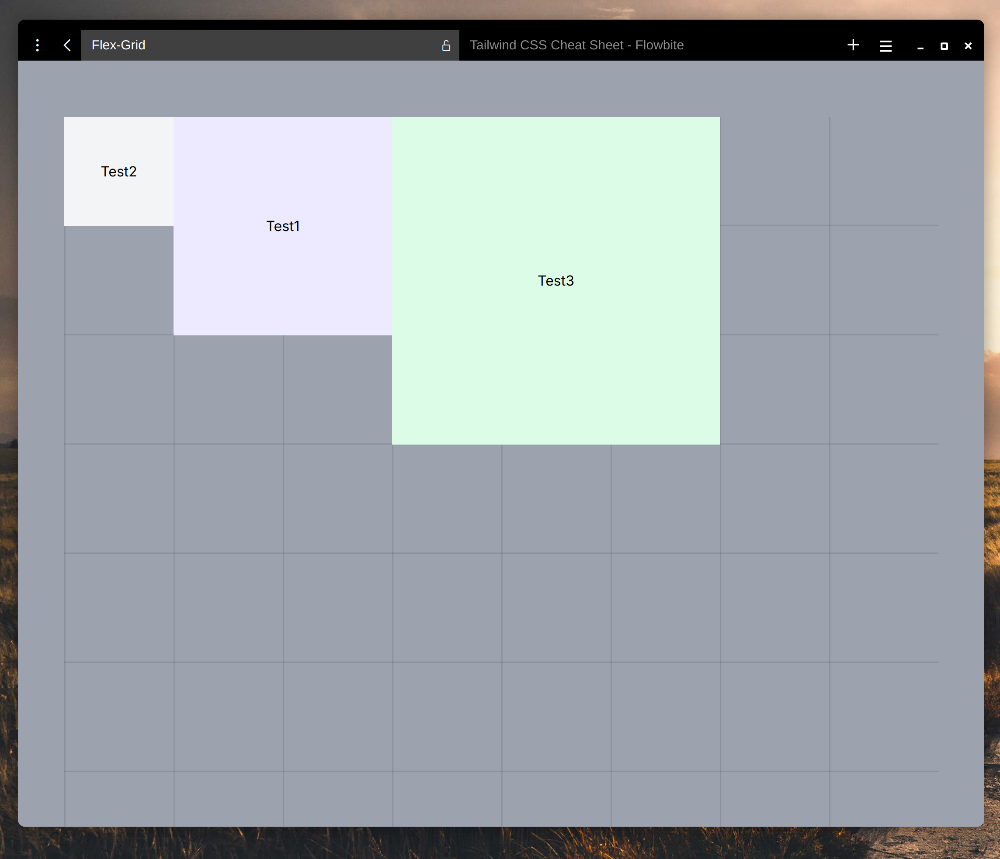
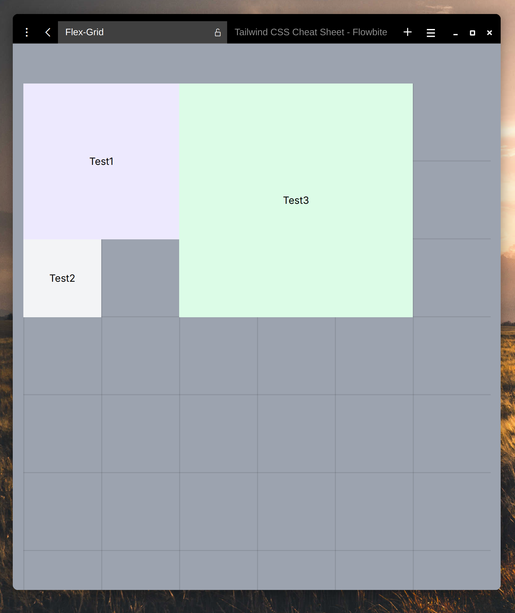
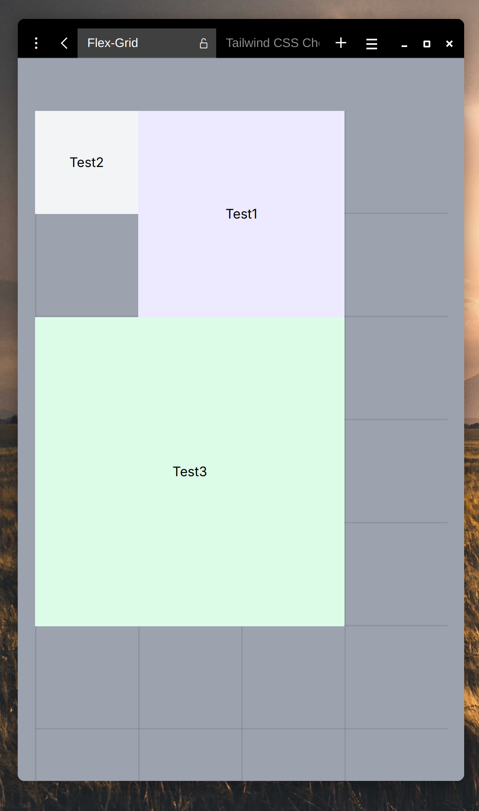

# Flex-Grid

A simple and dynamic flex grid built with **Next.js** and **Tailwind CSS**.  

This project demonstrates how to create a responsive grid system using customizable `Tile` components. Each `Tile` can dynamically adapt its size and position based on screen breakpoints (`lg`, `md`, `sm`). The grid layout is built to make it easy to define and manage tiles on the screen.

## Features
- **Responsive Design**: Position tiles differently for `lg`, `md`, and `sm` breakpoints.
- **Custom Tile Sizes**: Easily specify width and height for each tile.
- **Dynamic Positioning**: Place tiles anywhere on the grid using absolute positioning relative to the parent layout.

## Example Usage

Here's how you can define and position tiles dynamically within the grid layout:

```tsx
import Tile from "@/components/Tile";
import GridLayout from "@/layouts/GridLayout";

export default function TestPage() {
  return (
    <GridLayout className="bg-gray-400">
      <Tile
        className="bg-violet-100 text-black"
        pos={{
          lg: { x: 0, y: 0 },
          md: { x: 0, y: 0 },
          sm: { x: 0, y: 0 },
        }}
        size={{ width: 2, height: 2 }}
      >
        Test Tile
      </Tile>
    </GridLayout>
  );
}
```
## Toy Example

### Illustraions

<table>
  <tr>
    <th>lg</th>
    <th>md</th>
    <th>sm</th>
  </tr>
  <tr>
    <td></td>
    <td></td>
    <td></td>
  </tr>
</table>

### Code
```tsx
import Tile from "@/components/Tile";
import GridLayout from "@/layouts/GridLayout";

export default function PlaygroundPage() {
  return (
    <GridLayout className="bg-gray-400 ">
      <Tile
        className="bg-violet-100 text-black"
        pos={{
          lg: { x: 1, y: 0 },
          md: { x: 0, y: 0 },
          sm: { x: 1, y: 0 },
        }}
        size={{ width: 2, height: 2 }}
      >
        Test1
      </Tile>
      <Tile
        className="bg-gray-100 text-black"
        pos={{
          lg: { x: 0, y: 0 },
          md: { x: 0, y: 2 },
          sm: { x: 0, y: 0 },
        }}
        size={{ width: 1, height: 1 }}
      >
        Test2
      </Tile>
      <Tile
        className="bg-green-100 text-black"
        pos={{
          lg: { x: 3, y: 0 },
          md: { x: 2, y: 0 },
          sm: { x: 0, y: 2 },
        }}
        size={{ width: 3, height: 3 }}
      >
        Test3
      </Tile>
    </GridLayout>
  );
}

```

## How to Run 

### Clone repository

```bash
git clone https://github.com/peplxx/flex-grid && cd flex-grid/flex-grid
```

### Install dependencies


```bash
npm install
```

### Run the development server

```bash
npm run dev
```
### Open in browser

```bash
http://localhost:3000/
```